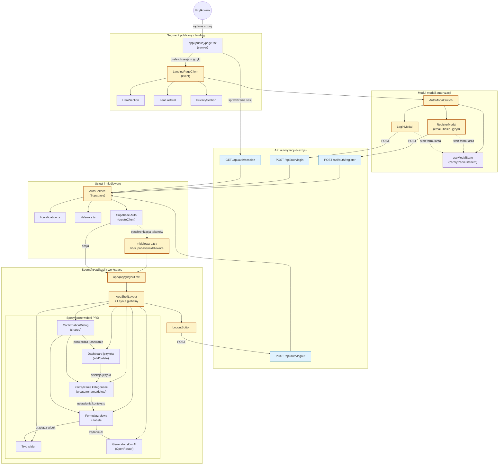

<architecture_analysis>
1. Komponenty z dokumentacji:
   - Layouty i strony: `app/layout.tsx`, `app/(public)/page.tsx`, `app/(app)/layout.tsx`, `components/app/app-shell-layout.tsx`.
   - Publiczne komponenty React: `LandingPageClient`, `HeroSection`, `FeatureGrid`, `PrivacySection`.
   - Moduły autoryzacji UI: `AuthModalSwitch`, `RegisterModal`, `LoginModal`, `useModalState`.
   - Kontrolki workspace: `LogoutButton`, dashboard języków, widoki kategorii i słów (tabela, slider), formularz słowa, generator AI, zunifikowane `ConfirmationDialog`.
   - Warstwa API: `/api/auth/register`, `/api/auth/login`, `/api/auth/logout`, `/api/auth/session`, `/api/languages`.
   - Warstwa usług: `AuthService`, `lib/validation.ts`, `lib/errors.ts`, `lib/supabase/server`, `middleware.ts`.
   - Zewnętrzne zależności: Supabase Auth, lista statycznych języków, OpenRouter (dla generatora słów zgodnie z PRD).
2. Główne strony i odpowiadające komponenty:
   - Landing (`app/(public)/page.tsx`) → ładuje dane i przekazuje je do `LandingPageClient`, który składa sekcje marketingowe oraz steruje `AuthModalSwitch`.
   - Workspace (`app/(app)/layout.tsx`) → pilnuje sesji, wykorzystuje `AppShellLayout` (nagłówek, `LogoutButton`, slot na dashboard języków, zarządzanie kategoriami i trybami nauki).
3. Przepływ danych:
   - Żądanie landing pobiera status sesji (`/api/auth/session`) i listę języków → dane trafiają do `LandingPageClient`.
   - `AuthModalSwitch` wykorzystuje `useModalState` do przełączania `RegisterModal`/`LoginModal`.
   - Formularze wykonują walidację lokalną, następnie wywołują odpowiednie endpointy `/api/auth/*`, które delegują do `AuthService`.
   - `AuthService` używa `lib/validation`, mapuje błędy i komunikuje się z Supabase; middleware synchronizuje cookies, dzięki czemu `app/(app)/layout.tsx` może odczytać sesję.
   - Po autoryzacji `AppShellLayout` udostępnia dane komponentom zarządzającym językami, kategoriami i trybami nauki (tabela, slider, generator AI) opisanymi w PRD.
4. Opisy funkcjonalności:
   - `app/(public)/page.tsx`: serwerowa strona publiczna, przekierowuje zalogowanych do `/app`.
   - `LandingPageClient`: klient sterujący sekcjami marketingowymi i otwieraniem modali.
   - `AuthModalSwitch` + `useModalState`: zarządzanie stanem widoczności formularzy logowania/rejestracji.
   - `RegisterModal`/`LoginModal`: formularze z walidacją i komunikacją z API; rejestracja wymusza wybór języka użytkownika (PRD 3.1).
   - `/api/auth/*` + `AuthService`: obsługa logiki Supabase (signUp/signIn/signOut), tworzenie profilu z niezmiennym językiem, mapowanie błędów.
   - `middleware.ts`: synchronizacja cookies Supabase dla SSR i API.
   - `app/(app)/layout.tsx` + `AppShellLayout`: ochrona tras, wspólny UI workspace, wstrzyknięcie `LogoutButton`.
   - Dashboard języków, zarządzanie kategoriami, CRUD słów, tryby tabela/slider, generator AI oraz dialogi potwierdzeń: funkcjonalności opisane w PRD, korzystające z uwierzytelnionej sesji.
</architecture_analysis>

<mermaid_diagram>

</mermaid_diagram>

